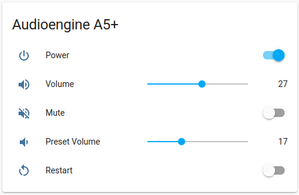
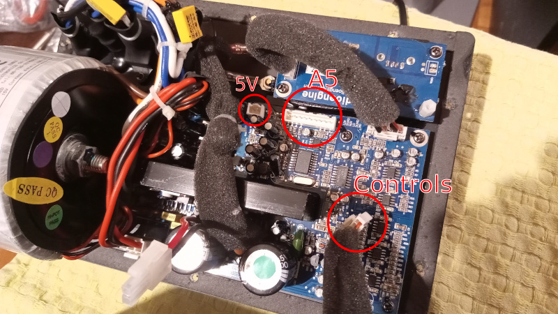
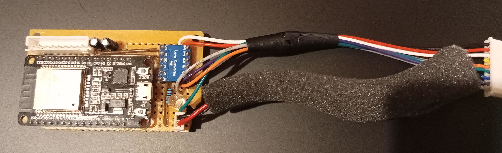
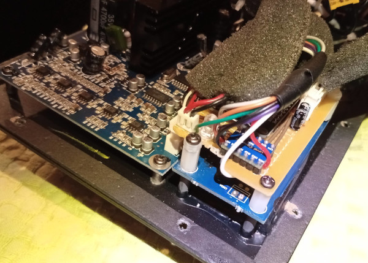

## Embedded controller for Audioengine A5



The [Audioengine
A5](https://audioengineusa.com/shop/poweredspeakers/a5-plus-classic-speakers/)
(classic model, no bluetooth) is a fantastic set of powered speakers. However,
it might be annoying to have an essential part of your living room controlled
only by a physical button and IR remote.

This project builds an ESP32 controller (based on [ESPHome](https://esphome.io/))
embedded in Audioengine A5, with two main features:

1. Remote control and automation
    - The speaker's Power (sleep), Volume and Mute can be controlled via [Home Assistant](https://home-assistant.io/) and used in automations.
    - Built-in controls (IR, rotary, button) are still usable and update the values
        in Home Assistant.
    - Some simple automations can run in the controller itself, eg a timer to
      turn the speaker off at night if it has been idle for too long.

2. Full customization of built-in controls. For example:
    - The LED brightness indicates the volume level.
    - The LED turns off (instead of blinking) when the speaker is off.
    - Long pressing the physical button sets the volume to a preset level.
    - Smoother rotary control.
    - The IR codes can be modified so any remote can be used.
    - Add an IR command to set the volume to a preset level.
    - Even add IR commands that trigger any Home Assistant
    automation.


## Idea

Powered speakers are often automated by sending IR commands from some hub
or Arduino/ESP device. However this has several drawbacks:

- Requires an IR transmitter within line-of-sight from the speaker.
- IR is often unreliable.
- Most importantly, Home Assistant is completely unaware of any manual inputs to
the speaker. This is particularly annoying for speakers with a single "toggle
power"  command (instead of separate "on" and "off"), such as the Audioengine
A5.  We might want to turn the speaker on and end up doing the exact opposite,
because the speaker was already manually turned on!

So we opt for a more advanced solution:
- We add an ESP32 device __embedded inside__ the speaker, in-between the
built-in controls and the speaker's MCU.
- All built-in controls are handled by the ESP32 based on our code.
- The ESP32 communicates changes to the speaker by simulating
    outputs from the built-in controls.

This way everything happens inside the speaker, and we can fully control
its state.

## Hardware

__WARNING:__ I'm just a hobbyist, I don't pretend I really know what I'm doing. Proceed at your own risk.

#### Audioengine A5 built-in controls

The A5 has 3 controls located at the front of the speaker: a rotary encoder (with button), an IR receiver and an LED. All three are connected to the
A5's board via a cable, conveniently equipped with a 9-pin JST connector
so that it can be easily removed.
The image below shows the cable and the place where it connects on the A5
(the following [youtube video](https://www.youtube.com/watch?v=RtI95P0j_7A)
also shows the internals of A5):



All three controls are standard, so a bit of reverse engineering reveals
the purpose of each pin (counting from left to right in the picture above):

```
Rotary encoder (pins 1-4)
1. Rotary output A
2. Rotary output B
3. Button output
4. GND

IR receiver (pins 5-7)
5. Output
6. GND
7. VCC

LED (pins 8-9)
8. + side
9. - side
```
Note that the A5 uses 5V logic, and all input pins have pullups.


#### Components we need

- An ESP32 development board (I used [this one](https://www.mischianti.org/wp-content/uploads/2020/11/ESP32-DOIT-DEV-KIT-v1-pinout-mischianti.png), ESP8266 might also be sufficient)
- A Logic Level Shifter with at least 4 channels (like [this one](https://github.com/sparkfun/Logic_Level_Bidirectional))
- Two capacitors (0.1 μF)
- Two resistors (100Ω and 1KΩ)
- JST XH2.54 9 Pin male and female connectors
- One LED (optional for debugging)
- A 4cm x 6cm prototype board and spacers

The plan is to connect our ESP32 between the controls and the A5.


#### Connecting the controls to the ESP32

The connections between the controls and the ESP32 are shown below.
The GPIOs can vary of course, depending on the exact board we use
(mine is 
```
Rotary
1. Pin A   <->  GPIO05    <->  0.1 μF cap.  <->  GND
2. Pin B   <->  GPIO18    <->  0.1 μF cap.  <->  GND
3. Button  <->  GPIO19
4. GND     <->  GND

IR
5. Signal  <->  GPIO03
6. GND     <->  GND
7. VCC     <->  3V

LED
8. + side  <->  100Ω res.  <->  GPIO23
9. - side  <->  GND
```

The capacitors are useful for [cleaning up](https://www.candrian.gr/index.php/3-pin-rotary-encoder-how-to/) the signal from the rotary
encoder. The resulting behavior is much better that the A5's original
one, no more turning the knob one way and have the volume jump the other way.

Note also that the IR receiver works happily with the ESP32's 3V logic.


#### Connecting the A5 board to the ESP32

On the other side, we need to connect ESP32 to A5 so that we can output data to
it. Since A5's inputs have 5V pullups, we need all communication to pass through
the logic level shifter, to avoid frying the ESP32.  The connections are shown
below:

```
Rotary
1 Output A  <->  HV1/LV1   <->  GPIO04
2 Output B  <->  HV4/LV4   <->  GPIO16
3 Button    <->  HV3/LV3   <->  GPIO17
4. GND      discon. (we already have common GND from pin 6 below)

IR
5. Output   <->  HV2/LV2   <->  GPIO15
6. GND      <->                 GND
7. VCC      discon. (ESP32 has its own power)

LED
8. + side   <->  1ΚΩ res.  <->  Debug LED +
9. - side   <->                 Debug LED -
```
Note that the front LED is controlled by the ESP32, so the A5's LED output
is not needed. Still, it's useful to add an LED to our board and connect
it to A5's output, to be able to see the speaker's original light while
debugging.


#### Powering the ESP32

The A5 has a USB plug in the back which can be used to charge a smartphone
while playing music. The USB is connected to the 5V power supply shown
in the image above, so we can very conveniently use it to power our ESP32.

Since I don't use the USB, I chose to "steal" the nice cable with the
protective foam that connected the USB to the 5V, so I desoldered it and
added it to my controller board. This also freed some space for
mounting our board. But of course there should be enough power for
both the ESP32 and the USB, if one wishes to keep it.


#### Assembling and mounting the board

The board will go inside the speaker, so we need a clean job.  We put all the
pieces together, solder them to a 4cm x 6cm prototype board, add JST
terminals for easy connection and the foamy cable for power. The result:



Finally, next to the A5's main board there is a smaller board
holding some of the speaker's terminals in the back. Using some spacers,
we can very conveniently mount our board on top of it. There is
enough space so that it does not interfere with any other component
of the speaker. The result looks like it came straight from the factory:




## Software

To program our controller we can use ESPHome. It provides all the components
we need as well as excellent integration with Home Assistant.
The controller code is available in
[audioengine-a5-controller.yaml](audioengine-a5-controller.yaml), while
[audioengine-a5.yaml](audioengine-a5.yaml) contains the generic node
configuration (wifi, passwords, etc). To setup the board simply
run
```
esphome run audioengine-a5.yaml
```

Handling the input controls is easy, we can directly use ESPHome's
[`rotary_encoder`](https://esphome.io/components/sensor/rotary_encoder.html) and
[`remote_receiver`](https://esphome.io/components/remote_receiver.html)
components.

Communicating with the A5 board is a little bit more involved, since we need to
simulate the control outputs and send them to the A5's input pins:
- For IR, we can use the
[`remote_transmitter`](https://esphome.io/components/remote_transmitter.html)
component, and pretend that pin 5 of the A5 is an IR transmitter.
Since it's not really a transmitter, we just need to set
`carrier_duty_percent: 100%` to keep only "real" low frequency IR signal
without the high frequency modulation of an IR LED.

- For the rotary encoder, we manually generate the encoder's signal
by bit-banging, its format is quite simple. (I also tried to do it
via PWM, but it didn't seem to work and it wasn't worth the effort.)

Note that the Volume Up/Down and Power commands can be sent either via
IR or via the rotary encoder. It turns out that the rotary is both faster
and more reliable, so I opt for using that, keeping IR only for the Mute
command.

The communication with Home Assistant is done via the
[`switch`](https://esphome.io/components/switch/gpio.html) (for Power/Mute)
and [`number`](https://esphome.io/components/number/template.html) (for Volume)
components.
Changes to these components trigger the `update_speaker_state` which
transmits the changes to the speaker (serializing them in case of multiple changes).
Note that the Volume is displayed in Home Assistant as a textbox by default;
to display it as a slider use the following [lovelace
plugin](https://github.com/thomasloven/lovelace-slider-entity-row).

The speaker's current state is stored in the `power_cur, mute_cur, volume_cur`
global variables, which should always match the speaker's real state.
In case these variables become out of sync with the speaker for any reason,
the `sync_speaker_state` is executed on every boot to restore the synchronization.
This is achieved by forcing the volume to 0 (by sending lots of "Volume Down"),
and then increasing it again to the desired value.


